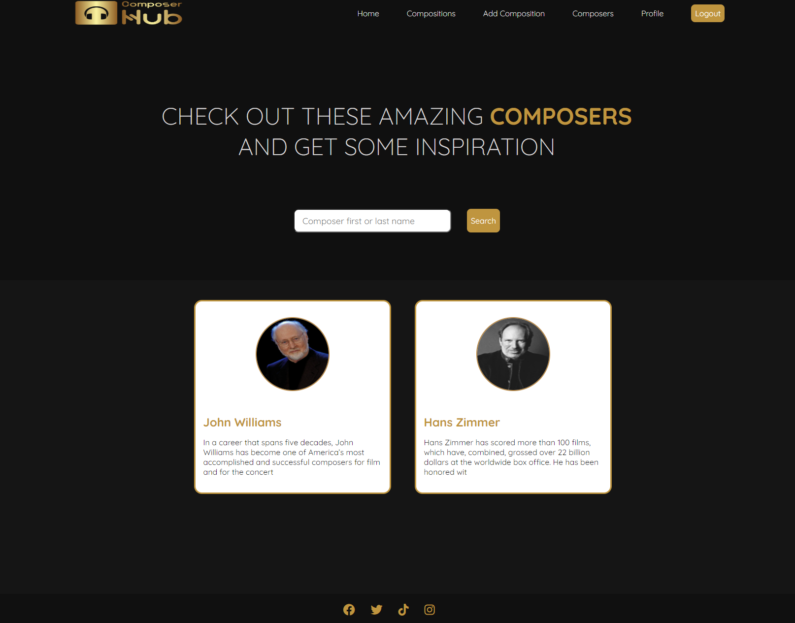

# Composer Hub - A place to find some inspiration and where you can inspire others

## Portfolio 4 project as part of the Diploma in Full Stack Software Development by Code Institute.
Composer Hub is a FullStack site that allows users to create a profile, log in and out and add their own compositions while viewing other composers and their work.

The live link can be found here - https://composerhub.herokuapp.com/

# Contents

* [Objective](<#objective>)
* [User Experience UX](<#user-experience-ux>)
    * [Target Audience](<#target-audience>)
    * [User Stories](<#user-stories>)
* [Design](<#design-choices>)
    * [Colour Scheme](<#colour-scheme>)
    * [Typography](<#typography>)
* [Features](<#features>)
    * [Registration](<#registration>)
    * [Edit Profile](<#edit-profile>)
    * [View Compositions](<#view-compositions>)
    * [View Composition](<#view-composition>)
    * [View Composers](<#view-composers>)
    * [View Composer](<#view-composer>)
* [Future Features](<#future-features>)
* [Technologies Used](<#technologies-used>)
* [Agile](<#agile>)
* [Testing](<#testing>)
    * [Testing](<#testing>)
    * [Bugs](<#bugs>)
    * [Validator Testing](<#validator-testing>)
* [Deployment](<#deployment>)
    * [Deployment to Heroku](<#deployment-to-heroku>)
* [Credits](<#credits>)
    * [Developer Team](<#developer-team>)

# Objective:

Design a clean, full stack site for Composers

The three main objectives are:

* ### Create a clean front end
    I wanted to make the front end visually appealing as the asthetic would need to match the quality of the audio compositions
* ### Utilise a functioning backend
    The backend allows user registration and profile creation, view profile, Edit profile, delete profile, add a composition, view others compositions and login and out,
* ### Use ElephantSQL to store the database
    ElephantSQL was used to store the PostgreSQL database

[Back to top](<#contents>)

# User Experience (UX):

## Target Audience

* Users that are interested in music composition and hoping to find inspiration and share their own work. 

## User Stories

### New Visitor Goals

* Understand what the site is about
* How to traverse the site
* Create and account

### Existing Visitor Goals

* Log in and out
* View, update or delete their account
* View other users compositions and add their own

[Back to top](<#contents>)

# Design Choices

## Colour Scheme

The colour scheme used for this project was only three colors to maintain a simple and clean look. 

* Grey/White 
* Gold
* Black

## Typography

I chose to use the Quicksand font from google fonts for the font.

[Back to top](<#contents>)

# Features

## Registration

The user can create a new account 

## Edit Profile

When the user creates their account, they are logged in straight away redirected to the profile edit page to enter more details. This can also be accessed any time using the profile link in the navbar.

## View Compositions

The user can view other's compositions that have been added to the site but going to the compositions link in the navbar and can search for them using the search box

## View Composition

The user can click on one of the compositions from the compositions page to be brought to that composition where they can get more information about the composition.

## View Composers

The user can view other's composers that have been added to the site but going to the composers link in the navbar and can search for them using the search box

## View Composer

The user can click on one of the composers from the composer's page to be brought to that composer's profile where they can get more information about them.

[Back to top](<#contents>)

# Future Features

* Implement a full CRUD for compositions
* Add discussions forum

[Back to top](<#contents>)

# Technologies Used

Here are a list of technologies used in this project

- [GitHub](https://github.com/) Used to host website
- [Gitpod](https://www.gitpod.io/) Used as IDE
- [Git](https://git-scm.com/) Version control
- [HTML](https://developer.mozilla.org/en-US/docs/Web/HTML) 
- [CSS](https://developer.mozilla.org/en-US/docs/Learn/Getting_started_with_the_web/CSS_basics) 
- [JavaScript](https://www.javascript.com/) 
- [Coloors](https://coolors.co/) Used to display the color palette image in the readme.
- [Taggit](https://django-taggit.readthedocs.io/en/latest/) Used for generating tags
- [PEP8 Validator](http://pep8online.com/) Used to check python code for errors
- [Heroku](https://id.heroku.com/login) Used to deploy the project
- [ElephandSQL](https://www.elephantsql.com/) Used to store PostgreSQL database.
- [Adobe Photoshop CS6](https://www.adobe.com/ie/products/photoshop.html) Used to create and edit images used for the site.

[Back to top](<#contents>)

# Agile

Agile was used in this project. Epics and Issues can be found here
[Issues](https://github.com/Sdalsosa/ComposerHub/issues) 
[Epics](https://github.com/Sdalsosa/ComposerHub/milestones) 

# Testing 

I have spent many hours testing this site and had friends go through it for me also.

This led to many issues being identified most of which were styling and CSS related as I used custom styling for the entire site.

## Testing

| TEST | OUTCOME | PASS / FAIL |
|:---:|:---:|:---:|
| Register Account | Account created correctly | PASS |
| log in | log in correctly | PASS |
| log out | log out correctly | PASS |
| Edit Profile | Edit profile correctly | PASS |
| Add composition | Add Composition correctly | PASS |
| Search compositions | Search compositions correctly | PASS |
| Search Composers | Search Composers correctly | PASS |
| Delete Account | Delete Account  correctly | PASS |

## Bugs

Reported in [Bugs](https://github.com/Sdalsosa/ComposerHub/issues) 

## Validator Testing 

- Python
  - No errors were found when passing through the official PEP8 validator

[Back to top](<#contents>)

# Deployment

## Deployment to Heroku

* Log into Heroku or create an account if you don't already have one.
* Click 'New' from the top right of the screen.
* Select 'Create new app'.
* Enter a unique application name - select appropriate region.
* Click 'Create app'
* One the following page, click the 'Settings' tab and scroll to Config Vars.
* In the KEY input field, enter 'PORT' and in the VALUE input field, enter '8000'.
* Click 'Add'.
* On the same page, scroll down to buildpacks and add two buildpacks.
* The ordering for these is heroku/python followed by heroku/nodejs.
* At the top of the page, click 'Deploy'.
* Select Github as the deployment method.
* Search for and select correct repository and click 'Connect'.
* At the bottom of the same page, select either Automatic Deployment or Manual Deployment 
* Wait for your site to be deployed.

[Back to top](<#contents>)

# Credits

[Python Documentation](https://docs.python.org/3/) This was invaluable for figuring out how to use different functions to manipulate the data, from the API especially.

[Code Institute](https://learn.codeinstitute.net/) I used the SCOPE from the love sandwiches project for the Google Sheets API and also refered back to the course material many times.

[Stack Overflow](https://stackoverflow.com/questions/2084508/clear-terminal-in-python) Code used to clear terminal window

[Back to top](<#contents>)

## Developer

* Alan Egan - Junior Software Developer at Code Institute

[Back to top](<#contents>)